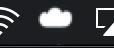
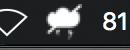

# Icon Ping 1.1

Fork of http://antirez.com/iconping with 64bit support for MacOS 10.15 Catalina, and new monochrome icons for retina displays and dark mode.

## DISCLAIMER

All actual code is from [antirez](https://github.com/antirez): http://antirez.com/iconping

I just 
- made a build for modern macOS versions
- updated the icons

## I just want 64bit support!

That's cool, checkout [the 64bit branch](https://github.com/deyhle/iconping/tree/64bit) or just download a build of v 1.03, which only adds 64bit support for MacOS 10.15 Catalina and is otherwise unchanged:

- [Icon Ping 1.03](https://github.com/deyhle/iconping/raw/master/products/iconping-1.03-64bit.zip)

## I also want the new icons!

Version 1.1 is for you:

- [Icon Ping 1.1](https://github.com/deyhle/iconping/raw/master/products/iconping-1.1.zip)

Online:

Offline:

The yellow state is just a cloud with lightning.